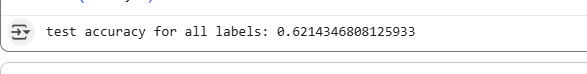
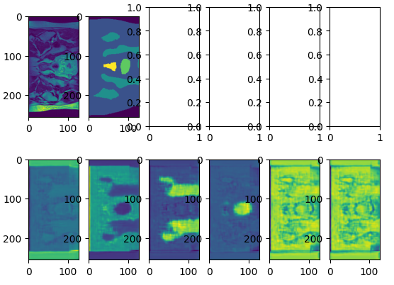

# UNet For HipMRI Study on Prostate Cancer (Task 2)

### Requirements

Version is relievent:

python=3.10.12
torch=2.8.0+cu126
nibabel=5.3.2

Just get the newest one and it should be fine:

IPython
matplotlib

### Downloading the data

We are using the rangpur data, so consult the UQ documentation to download that, or run the model from their machines.

### Running the model

#### Training the model

Running the model is pretty straight forward, the following code will run the train the model:

```python
import torch
from modules import ImprovedUNET
from train import train

d = torch.device("cuda" if torch.cuda.is_available() else "cpu")
model = ImprovedUNET(classes=6).to(d)
a = train(model,d)
```

On completion you will get a "model.pth" file saved to the dir, and the local variable "model" can be played with.

#### Testing/Visulization

Testing is very similar to training, assuming you kept the model variable around, you can just pass that straight in:

```python
from predict import test, disp

test(model, d)
disp(model, d)
```

The output for the test should look like, and did in my case when running:



The output for disp should look like:



The way to inprepret the diagram is you have at the top the input, and the expected map, then for each image below you have the learned shape for each label.

### Preprocessing for model

I Did'nt see anyone advocating for any preprocessing transformations on the data, so I did not use any. 
